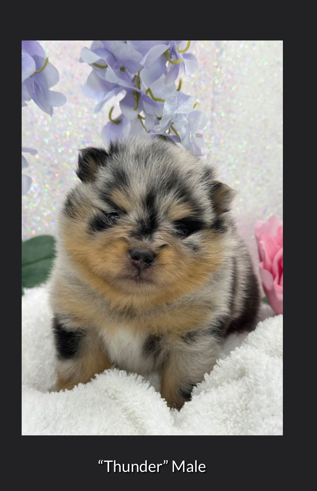

# Welcome to Thunder's Puppy Training Guide 🐕

This comprehensive guide provides everything you need to know about raising and training a Pomeranian puppy from 8 to 24 weeks old. Follow this structured approach for the best results!

## 📚 Training Guides

### Core Training Materials
- **[Comprehensive Puppy Training Guide]({{ "/comprehensive-guide/" | relative_url }})** - The complete week-by-week training plan
- **[Puppy Schedule (8-10 Weeks)]({{ "/puppy-schedule/" | relative_url }})** - Detailed daily schedule for young puppies
- **[Nighttime Guide]({{ "/nighttime-guide/" | relative_url }})** - Overnight potty training routine
- **[Pomeranian Adoption Plan]({{ "/adoption-plan/" | relative_url }})** - Complete adoption and preparation plan

## 🎯 Quick Navigation

### By Training Phase
- **Week 1 (8 weeks)**: Focus on overnight potty schedule
- **Weeks 2-4 (9-11 weeks)**: Basic training and socialization
- **Weeks 5-8 (12-16 weeks)**: Advanced training and boarding prep
- **Weeks 9-16 (17-24 weeks)**: Home transition and advanced commands

### Key Topics
- Potty training schedules
- Feeding guidelines (Royal Canin Small Puppy)
- Socialization milestones
- Training costs and budgeting
- Equipment recommendations

## 💡 Training Principles

This guide emphasizes:
- **Consistency** in schedule and routine
- **Positive reinforcement** with treats and praise
- **Patience** during the learning process
- **Professional support** when needed

---

*Total estimated cost for first 6 months: $13,080 - $14,500* 